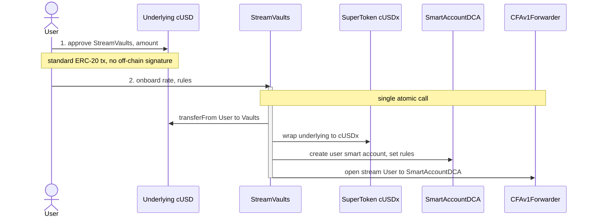
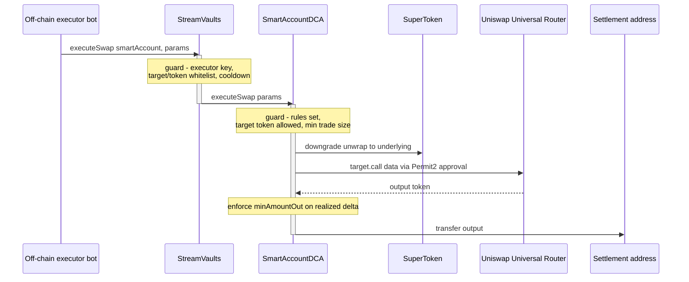

# StreamVaults DCA — Contracts

Smart contracts for **StreamVaults DCA**, a non-custodial dollar-cost-averaging protocol
built on continuous token streams. Users stream a stablecoin into a personal smart account;
an off-chain executor triggers rule-bounded swaps into the user's target assets.

This package is the **Celo** deployment (Foundry). The reference implementation
([JulioMCruz/Streams](https://github.com/JulioMCruz/Streams), Hardhat) targets Base; the
core contract logic is unchanged — only the external-dependency addresses and the
onboarding approval path differ.

---

## Architecture

Three core contracts plus one smart account per user:

| Contract | Type | Responsibility |
|---|---|---|
| **`StreamVaultsConfig`** | UUPS | Protocol config: executor key, swap-target whitelist, supported tokens, smart-account implementation, Permit2 and Superfluid `CFAv1Forwarder` addresses. |
| **`StreamVaults`** | UUPS | Central gateway. Factory for EIP-1167 `SmartAccountDCA` clones; stream gateway routing Superfluid flows via `CFAv1Forwarder`; swap orchestrator validating whitelists before forwarding orders. |
| **`SmartAccountDCA`** | EIP-1167 clone | Per-user account holding streamed funds and executing rule-bounded DCA swaps (max slippage, min trade size, target-token allowlist). |

**Execution model.** A single off-chain executor drives continuous execution. Every swap
is bounded on-chain by the user's rules, a per-account cooldown, and target/token
whitelists. Kill switch: revoke the Superfluid flow-operator permission (a standard
transaction).

**Router-agnostic swaps.** `SmartAccountDCA.executeSwap` performs `params.target.call(params.data)`;
the router and its calldata are built off-chain by the executor. Changing chain or DEX means
changing whitelisted addresses in config — never the Solidity.

---

## Protocol flows

### Onboarding — `approve()` + single-call `onboard()`



### Execution — rule-bounded DCA swap



Kill switch (not shown): the user revokes the Superfluid flow-operator permission with a
standard transaction, stopping all future streaming into the smart account.

---

## Celo integration

External dependencies on **Celo mainnet (42220)**, verified against Uniswap deployments,
`@superfluid-finance/metadata`, and CeloScan.

| Dependency | Address | Status |
|---|---|---|
| Permit2 | `0x000000000022D473030F116dDEE9F6B43aC78BA3` | Canonical — reuse |
| Uniswap Universal Router | `0x643770E279d5D0733F21d6DC03A8efbABf3255B4` | Reuse (whitelisted target) |
| Superfluid `CFAv1Forwarder` | `0xcfA132E353cB4E398080B9700609bb008eceB125` | Canonical — reuse |
| Superfluid `Host` | `0xA4Ff07cF81C02CFD356184879D953970cA957585` | — |
| Superfluid `SuperTokenFactory` | `0x36be86dEe6BC726Ed0Cbd170ccD2F21760BC73D9` | Used to deploy the stream SuperToken |
| NativeTokenWrapper (CELOx) | `0x671425Ae1f272Bc6F79beC3ed5C4b00e9c628240` | — |

### Tokens (Celo mainnet)

| Token | Address |
|---|---|
| CELO | `0x471EcE3750Da237f93B8E339c536989b8978a438` |
| cUSD | `0x765DE816845861e75A25fCA122bb6898B8B1282a` |
| cEUR | `0xD8763CBa276a3738E6DE85b4b3bF5FDed6D6cA73` |
| USDC (Circle) | `0xcebA9300f2b948710d2653dD7B07f33A8B32118C` |
| USDT | `0x48065fbBE25f71C9282ddf5e1cD6D6A887483D5e` |

---

## Deltas from the reference implementation

The core contract logic is copied unchanged. Two protocol-level differences apply on Celo.

### 1. The stream SuperToken must be deployed

No stablecoin SuperToken exists on Celo. A Wrapper Super Token — recommended **cUSDx**,
wrapping cUSD — is deployed via `SuperTokenFactory.createERC20Wrapper` before the protocol
is configured, and its address is set in `StreamVaultsConfig`.

### 2. Onboarding: `approve()` + single-call `onboard()`

The reference entrypoint (`startStreamBot`) folds an EIP-2612 `permit` **inside** the call,
making setup atomic without a prior approval. The Celo port removes the off-chain signature,
so onboarding is a two-transaction flow that **preserves the atomicity of all state
changes**:

1. **`approve()`** — standard ERC-20 approval of the underlying to the gateway, sent as a
   normal transaction.
2. **`onboard()`** — a **single call** that still bundles the entire setup:
   - `transferFrom` the approved underlying into the gateway,
   - wrap it into the SuperToken (`upgradeTo`),
   - deploy the user's EIP-1167 `SmartAccountDCA` clone and `initializeWithRules`,
   - open the Superfluid stream into it via `CFAv1Forwarder`.

The change is confined to the entrypoint: the `permit()` step and the `Permit2612Sig`
parameter are dropped; everything downstream stays in one atomic call.

Uniswap requires no contract-level replacement: `allowedTargets` is a multi-entry
whitelist, so additional routers are added through config and the executor alone.

---

## Build & test

The full suite runs against a **fork of Celo mainnet** — real addresses and liquidity:

```bash
forge build

# Fork tests
forge test --fork-url https://forno.celo.org -vvv

# Local fork node
anvil --fork-url https://forno.celo.org
```

RPC endpoint (`foundry.toml`): `celo` → https://forno.celo.org

---

## Roadmap

- [ ] Port contracts from the reference implementation into `src/` (Hardhat → Foundry)
- [ ] `approve()` + single-call `onboard()` entrypoint
- [ ] cUSDx SuperToken deployment script (`SuperTokenFactory`)
- [ ] Celo mainnet address config
- [ ] Fork-based test suite

## References

- Reference implementation: https://github.com/JulioMCruz/Streams
- Uniswap on Celo: https://docs.celo.org/contracts/uniswap-contracts
- Superfluid metadata: https://github.com/superfluid-finance/protocol-monorepo/blob/dev/packages/metadata/networks.json
